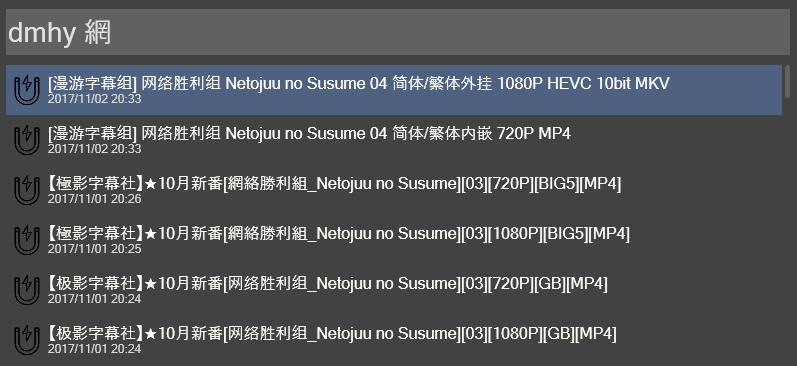
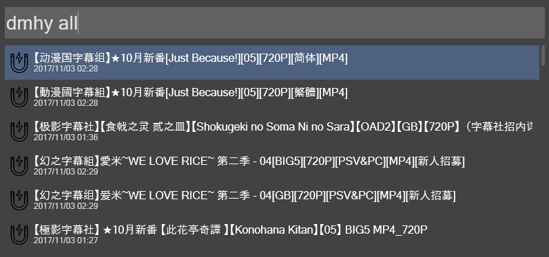
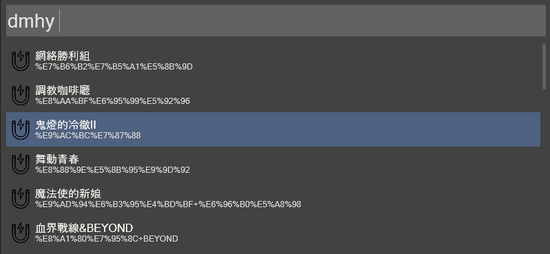

Wox-BT-DMHY
======
My `share.dmhy.org` [Wox](http://www.getwox.com/) plugin  
Easy browse dmhy resource and copy magnet link to clipboard 
1. Search Bt magnet

2. Browse Bt Resource

3. Custom keyword shortcut

## Prerequisites
---
Depend on [Pyperclip](https://github.com/asweigart/pyperclip)

## Installing
---
1. Download the [Plugin](https://github.com/sd12582000/wox_bt_dmhy/releases)
2. Edit `config.json`
3. copy the plugin to `<WoxDirectory>\Plugins\<YourPluginDirectory>`
4. restart the Wox
## Configuration
---
Edit the `config.json` file
```
{
    "use_filter":true,
    "allow_sort":["sort-2","sort-4","sort-43","sort-44"],
    "default_all":false,
    "default_key":[
        {"Name":"舞動青春","Key":"%E8%88%9E%E5%8B%95%E9%9D%92"},
        {"Name":"調教咖啡廳","Key":"%E8%AA%BF%E6%95%99%E5%92%96"},
        {"Name":"鬼燈的冷徹Ⅱ","Key":"%E9%AC%BC%E7%87%88"},
        {"Name":"魔法使的新娘","Key":"%E9%AD%94%E6%B3%95%E4%BD%BF+%E6%96%B0%E5%A8%98"},
        {"Name":"血界戰線&BEYOND","Key":"%E8%A1%80%E7%95%8C+BEYOND"},
        {"Name":"3月的獅子Ⅱ","Key":"%E7%9A%84%E7%8D%85%E5%AD%90"},
        {"Name":"銀魂","Key":"%E9%8A%80%E9%AD%82%7CGintama"},
        {"Name":"動畫同好會","Key":"%E5%8B%95%E7%95%AB%E5%90%8C%E5%A5%BD"},
        {"Name":"如果有妹妹就好了。","Key":"%E6%9C%89%E5%A6%B9%E5%A6%B9"},
        {"Name":"泥鯨之子們在沙地上歌唱","Key":"%E4%B8%8A%E6%AD%8C"}
    ]
}
```
### Attributes
* *use_filter* : if you only want specificy category set true
* *allow_sort* : result only contain specificy category if use_filter=true 
* *default_all* : if true query `dmhy` equal `dmhy all` 
* *default_key* : if `default_all` sets false query `dmhy` show it  

## License
This plugin is licensed under the MIT License 